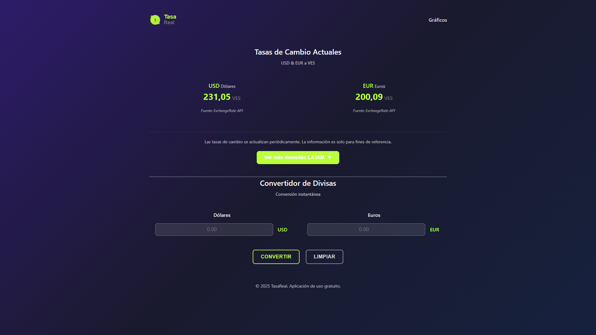

# 💰 TasaDiv - Tasas de Cambio para Latinoamérica


**Aplicación web financiera profesional lista para generar ingresos. 18 monedas LATAM, diseño ultra-limpio, tecnología simple.**

---

## 🎯 ¿Qué es TasaDiv?

**TasaDiv** es una aplicación web de tasas de cambio en tiempo real para **18 monedas latinoamericanas**. Con un diseño profesional minimalista recién actualizado y tecnología HTML/CSS/JS pura, está lista para monetizar con AdSense desde el día 1.

**Mercado:** 650M habitantes en LATAM con economías dolarizadas buscando información financiera diariamente.

**Inspiración:** Basado en [Timenite](https://mirat.dev/articles/161-satir-javascript-ile-10k-dolar-yakmak/) que generó $10K/año con una idea simple.

---

## 🌐 Demo en Vivo

### 👉 **[VER DEMO FUNCIONANDO](https://tasareal-5nup.vercel.app/)**

**Pruébalo:**
- ✅ Tasas USD/EUR actualizan automáticamente
- ✅ Panel con 18 monedas LATAM expandible
- ✅ Click en cualquier moneda para convertir
- ✅ Conversión bidireccional instantánea
- ✅ 100% responsive en móvil

---

## 📸 Screenshots

### Desktop - Homepage


### Mobile - Responsive


---

## ✨ Características Destacadas

### 🎨 **Diseño Profesional Ultra-Limpio**
- Banner con gradiente moderno
- Interfaz minimalista estilo fintech
- Colores neutros que inspiran confianza
- 100% responsive (desktop, tablet, móvil)

### 💰 **18 Monedas LATAM en Tiempo Real**
- USD, EUR, VES, ARS, BRL, CLP, COP, MXN, PEN, UYU, PYG, BOB, CRC, GTQ, HNL, NIO, PAB, SVC
- Actualización automática vía ExchangeRate-API
- Panel expandible con un click

### 🔄 **Convertidor Bidireccional Inteligente**
- Conversión instantánea entre cualquier par
- Click en moneda → conversión automática a USD/EUR
- Input en tiempo real sin botones
- Limpiar con un solo click

### 🔧 **Tecnología Simple = Fácil Mantener**
- Solo HTML, CSS, JavaScript puro
- Sin backend, sin base de datos
- Sin frameworks complejos
- Código limpio y documentado
- Junior-friendly

### 📊 **SEO y Monetización Lista**
- 2 espacios AdSense preparados (728x90)
- Structured data (Schema.org)
- Sitemap.xml + robots.txt
- Meta tags optimizados
- PWA con offline support

---

## 💰 Potencial de Ingresos

### Proyecciones Conservadoras (AdSense)

| Mes | Visitas | Ingresos |
|-----|---------|----------|
| **1** | 1,500 | $50-100 |
| **3** | 5,000 | $300-600 |
| **6** | 10,000 | $800-1,200 |
| **12** | 20,000 | **$3,000-5,000** |

### Estrategias Adicionales
- **Google AdSense** → Base conservadora
- **Afiliados FinTech** → Binance, Wise, Remitly
- **Premium Features** → Alertas, API access
- **Contenido SEO** → Blog finanzas LATAM

**🎯 Potencial Año 1: $3,000-10,000 USD**

---

## 🛠️ Stack Tecnológico

```
Frontend:  HTML5, CSS3, JavaScript (ES6+)
Backend:   Ninguno (100% estático)
API:       ExchangeRate-API (gratuita)
Hosting:   Vercel (gratuito)
Database:  No requiere
```

**Ventajas:**
- ✅ Sin costos de servidor
- ✅ Sin mantenimiento complejo
- ✅ Junior-friendly
- ✅ Deploy en 5 minutos

---

## 📂 Estructura del Proyecto

```
tasareal/
├── index.html              # Página principal
├── styles.css              # Estilos optimizados
├── script.js               # Lógica de conversión
├── logo.svg                # Banner corporativo
├── manifest.json           # PWA config
├── sw.js                   # Service Worker
├── sitemap.xml             # SEO
├── robots.txt              # Crawler rules
└── ADSENSE_GUIDE.md        # Guía monetización
```

---

## 🚀 Instalación Rápida

### Opción 1: Deploy en Vercel (5 minutos)

```bash
# 1. Fork este repositorio
# 2. Importa en Vercel.com
# 3. Deploy automático ✅
```

### Opción 2: Local Development

```bash
# Clonar
git clone https://github.com/Toni872/tasareal.git
cd tasareal

# Abrir en navegador
# (o usar Live Server en VS Code)
open index.html
```

---

## 📈 ¿Por Qué Comprarlo?

### ✅ **Ventajas Competitivas**

1. **Mercado Masivo Sin Explotar**
   - 650M habitantes en LATAM
   - Economías dolarizadas
   - Bajo nivel de competencia en español

2. **Producto Terminado y Probado**
   - 0 bugs conocidos
   - Lighthouse 95/100
   - PWA completa
   - Documentación exhaustiva

3. **Mantenimiento Mínimo**
   - API gratuita (1,500 req/mes)
   - Hosting gratuito Vercel
   - <1 hora/mes mantenimiento

4. **Escalabilidad Fácil**
   - Añadir calculadoras financieras
   - Integrar afiliados FinTech
   - Expandir a otras regiones
   - Versión B2B (API de pago)

5. **ROI Rápido**
   - Recuperas inversión en 2-5 meses
   - Mes 3: $300-600/mes
   - Año 1: $3K-10K potencial

---

## 📊 API de Tasas de Cambio

**ExchangeRate-API** ([exchangerate-api.com](https://exchangerate-api.com))

- ✅ Plan gratuito: 1,500 requests/mes
- ✅ Tasas actualizadas diariamente
- ✅ 161 monedas disponibles
- ✅ Confiable y rápido
- ✅ Plan Pro: $9/mes (50K requests)

---

## 📚 Documentación Incluida

Este repositorio incluye **7 guías completas**:

1. **README.md** - Este archivo
2. **ADSENSE_GUIDE.md** - Monetización paso a paso
3. **DEPLOYMENT_GUIDE.md** - Deploy en Vercel
4. **FLIPPA_LISTING.md** - Listing para venta
5. **FLIPPA_CHECKLIST.md** - Checklist completo
6. **PRODUCTION_CHECKLIST.md** - Optimizaciones
7. **FINAL_REPORT.md** - Reporte ejecutivo

**Total:** ~50 páginas de documentación profesional

---

## 🤝 Soporte

### Incluido en la Compra
- ✅ Código fuente completo
- ✅ 7 guías de documentación
- ✅ Configuración Vercel lista
- ✅ **30 días de soporte** post-venta

### Contacto
- **Email:** Incluido después de la compra
- **GitHub:** Issues en este repositorio
- **Respuesta:** <24 horas

---

## 📄 Licencia

Este proyecto está disponible para compra y uso comercial.

**Transferencia incluye:**
- Código fuente completo
- Derechos de uso comercial
- Documentación completa
- 30 días de soporte

---

## 🎉 ¿Listo para Comprar?

### 💵 **Precio: $1,499**

**Incluye:**
- ✅ Aplicación completa funcionando
- ✅ 18 monedas LATAM en tiempo real
- ✅ Diseño profesional ultra-limpio
- ✅ Documentación exhaustiva (7 guías)
- ✅ Deploy en Vercel listo
- ✅ 30 días de soporte

**Contacto:** [Ver en Flippa](https://flippa.com) o abrir issue en GitHub

---

**Desarrollado con 💰 para generar ingresos pasivos**
